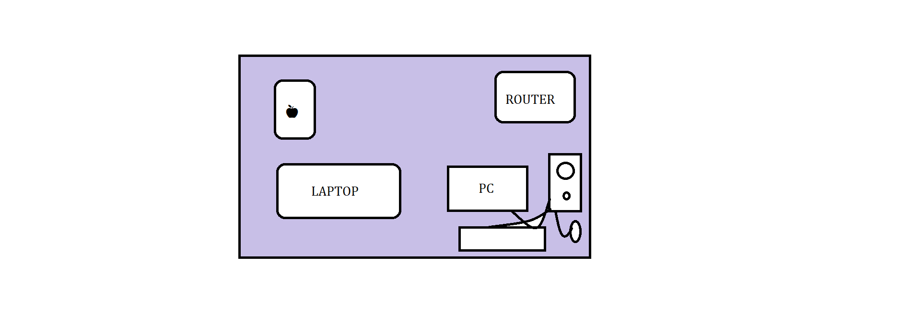
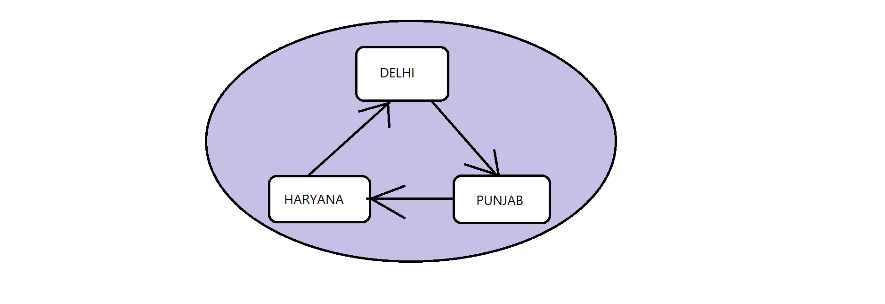
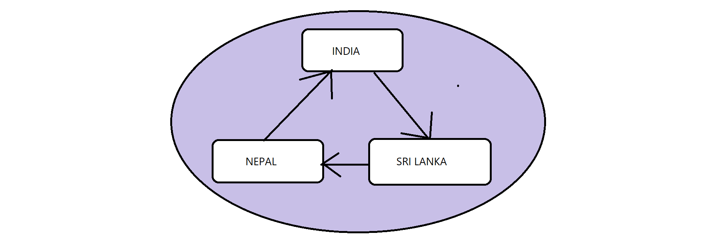

# UnderStanding Internet, Networks, Web & More

## In this lecture we are learning about these topics:

1. Network
2. Internet
3. IP Address
4. Browser
5. Browser Engine
6. Client and Server
7. How Facebook works?
8. How Google Works?

### 1. Network
#

<h4>⭐ What is Network?</h4>

- Resources that are interconnected with each other on different scales are called network.

### Let's take some examples to understand different types of scales:

#### Example: 1

- Imagine this figure as home/house 

    

- Resources are interconnected in small scale like house this network is known as **LAN** (Local Area Network)

### Example: 2

- Let's take an other example as we using network some big scale.

    

Here we see they are connected in big scale across cities this network is called **MAN** (Metro Politan Network)

### Example:3 

- We taking an example as using large scale of network.

    

Here we see that resources or devices are interconnected in such a large scale across countries is called **WAN** (Wide Area Network).