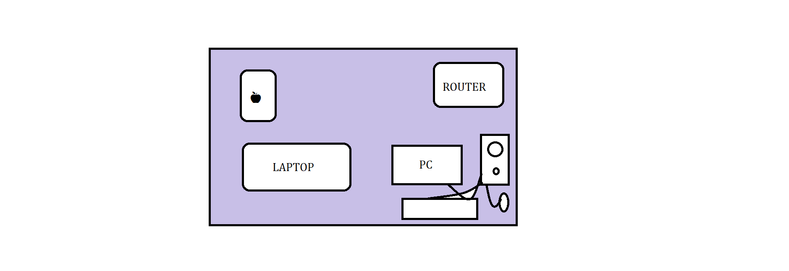
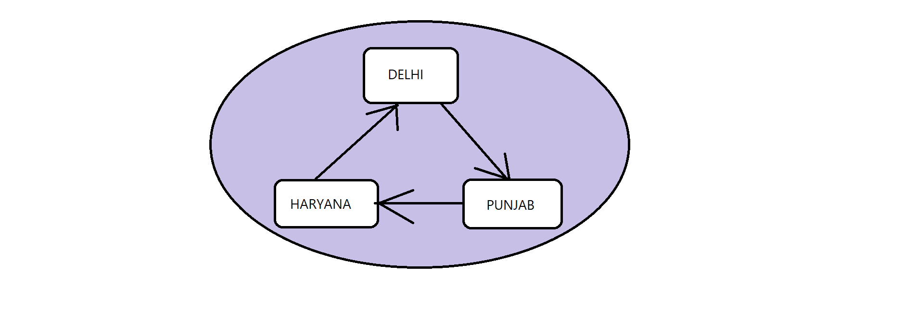
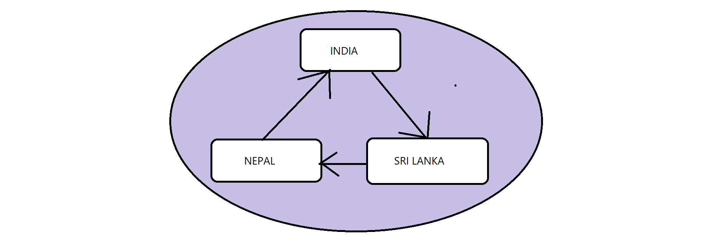

# UnderStanding Internet, Networks, Web & More

### 1. Network
##

<h4>⭐ What is Network?</h4>

- Resources that are interconnected with each other on different scales are called network.

### Let's take some examples to understand different types of scales:

#### Example: 1

- Imagine this figure as home/house 

    

- Resources are interconnected in small scale like house this network is known as **LAN** (Local Area Network)

### Example: 2

- Let's take an other example as we using network some big scale.

    

Here we see they are connected in big scale across cities this network is called **MAN** (Metro Politan Network)

### Example:3 

- We taking an example as using large scale of network.

    

Here we see that resources or devices are interconnected in such a large scale across countries is called **WAN** (Wide Area Network).

#

### 2. Internet
##

<h4>⭐ What is Internet?</h4>

- Internet is a global system where billions of devices & other resources are interconnected with each other.

- Internet is a **Global System/ Network of Networks**

#

### 3. WWW (World Wide Web)
##

<h4>⭐ What is WWW?</h4>

- Interconnected documents & other resources you can access via Internet.
- WWW is a *subset* of Internet.
  
#### Internet is a big entity, *WWW takes place inside of this big entity.*

#

### 4. IP Address
##

<h4>⭐ What is IP Address?</h4>

- If your machines are connected with internet or exist in the internet, then that machine have some address to identify this is known as IP Address.

#

### 5. Browser
##

<h4>⭐ What is Browser?</h4>

- Browser is a tool to access the data & other resources over internet like website, docs & web applications etc.

#

### 6. Browser Engine

<h4>⭐ What is Browser Engine?</h4>

- Browser Engine is a **brain of Browser** that helps you to execute rendering process. 

#

### 7. Client and Server

<h4>⭐ What is Client and Server?</h4>

- Over the Internet two machines communicating with each other and they send a request to other machine for giving back a data in response.

### **Client & Server Modal**

    

### **Types Of Clients:** 
- Laptop, PC, Mobile
- Browser
- Application
- CLI (Terminal)

### **Types of Server:**
- DB Server
- File Server
- Application Server
- Web Server
- Email Server
#

### 8. www.facebook.com/google.com

<h4>⭐ How www.facebook.com/google.com works?</h4>

- Client requesting a ***www.facebook.com/google.com*** it changes to **DNR**(Domain NET Resolution) then it converts to IP Address then you will get a server from the IP Address then it makes a request in the server after processing it gives you a response in your client. 