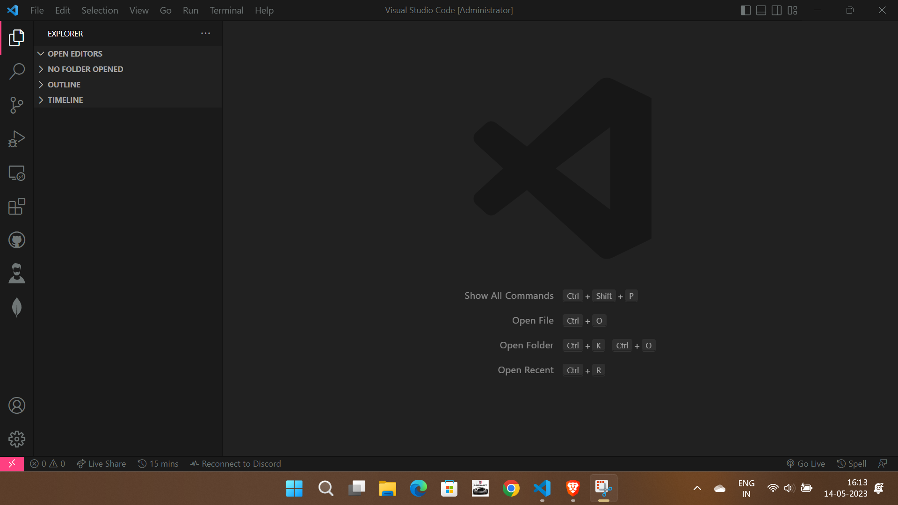
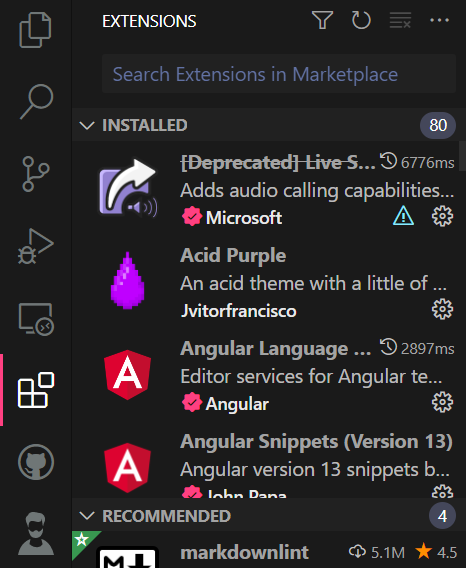
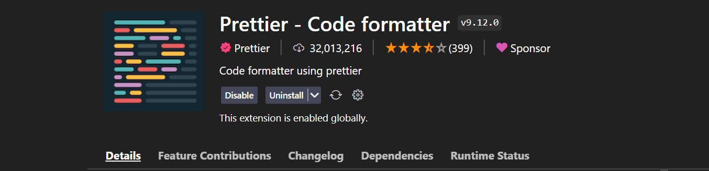

# Code your first HTML Program

### 1. HTML

- HTML (Hyper Text Markup Language) - Language that define structure of your website.
- You can Learn more about HTML [Documentation](https://developer.mozilla.org/en-US/docs/Web/HTML)

#

### 2. Environment Setup

- Setup 
  - Download / Install VS Code
  - Install 2 Extensions 

#### We are using VS Code. You can use Sublime, Atom, JetBrains etc..

- First you have to download **VS Code** from here [Download VS Code](https://code.visualstudio.com/)

<div align="center">
    
</div>

- You have multiple options to download for windows, macOS, linux etc..
- Download it anywhere you want.
- Then you have to install it, and you get something like this UI

<div align="center">
    
</div>


- There are some useful menus:
  - File Explorer


  <div align="center">
    
  </div>

  - Find & Replace Words
  
  <div align="center">
    
  </div>

  - Version Control (GitHub)

  <div align="center">
    
  </div>

  - Extensions 

  <div align="center">
    
  </div>


- You have to Install these 2 Extensions:
  - Prettier ➡️ [Installation LINK](https://marketplace.visualstudio.com/items?itemName=esbenp.prettier-vscode)

  <div align="center">
      
  </div>

  - Live Server ➡️ [Installation LINK](https://marketplace.visualstudio.com/items?itemName=ritwickdey.LiveServer)

  <div align="center">
    
  </div>

- I've already installed this, so you will see **install button** instead of **Uninstall**.
- You can install these extensions from **VS Code or the Link I mentioned here**.

#

### 3. First Program in HTML

#### HTML Boilerplate

```HTML
<!DOCTYPE html>
<html lang="en">
<head>
    <meta charset="UTF-8">
    <meta http-equiv="X-UA-Compatible" content="IE=edge">
    <meta name="viewport" content="width=device-width, initial-scale=1.0">
    <title>Document</title>
</head>
<body>
    
</body>
</html>
```