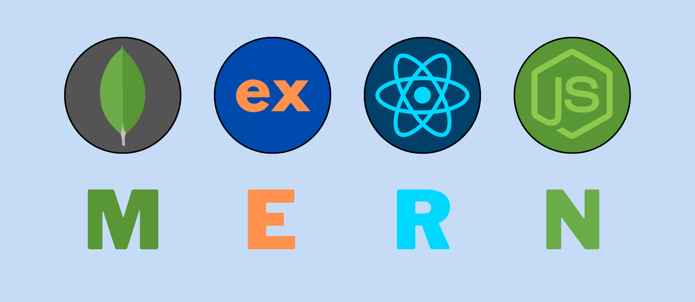

# Love Babbar Free MERN Stack Course Notes according to my understandings.

    

 

### Topics Cover in each Lecture:

[Lecture: 1](./Lecture_1_Notes.md) ➡️ [TUTORIAL LINK](https://youtu.be/Vi9bxu-M-ag)

- Learn Basics of Web Development
- Layers of Web Development

[Lecture: 2](./Lecture_2_Notes.md) ➡️ [TUTORIAL LINK](https://youtu.be/aRUhd1Wd3Sw)

- Network
- Internet
- WWW(World Wide Web)
- IP Address
- Browser
- Browser Engine
- Client and Server
- How www.facebook.com/google.com works? 

[Lecture: 3](./Lecture_3_Notes.md) ➡️ [TUTORIAL LINK](https://youtu.be/ofHYRdWQESo)

- What is Internet 
- Brief History
- Need of Address
- Client - Server Modal
- Protocol Stacks and Packets
- How a Packet travels over Internet
- Router and Routing Table
- Understand request for www.google.com
- Protocols

[Lecture: 4](./Lecture_4_Notes.md) ➡️ [TUTORIAL LINK](https://youtu.be/0gU-qrq3gjU)

- What is HTML?
- Environment Setup
- First Program in HTML
- Resources to follow
- HTML comments

[Lecture: 5](./Lecture_5_Notes.md) ➡️ [TUTORIAL LINK](https://youtu.be/KdWPGqT5GwE)

- Mastering HTML Tags

[Lecture: 6](./Lecture_6_Notes.md) ➡️ [TUTORIAL LINK](https://youtu.be/e1X3WPoETsk)

- Emmet
- Experimentation Using Emmet
- Elements grouping
- div tag
- Block vs Inline Elements
- List & Complexity
- Anchor tag Variations

[Lecture: 7](./Lecture_7_Notes.md) ➡️ [TUTORIAL LINK](https://youtu.be/VjCHupej12U)

- What is Table?
  - Example 1
  - Example 2
  - Example 3
  - Example 4 

[Lecture: 8](./Lecture_8_Notes.md) ➡️ [TUTORIAL LINK](https://youtu.be/dYrwawDa92U)

- Forms
  - What is Form?
  - Form tags 
  - Code
  - Form Elements
  - Input Types 

[Lecture: 9](./Lecture_9_Notes.md) ➡️ [TUTORIAL LINK](https://youtu.be/GmHC1oaK9Ts)

- HTML Forms: From Beginner to Pro
  - Project - 1
  - Project - 2 
  - Project - 3

    <h4> Please ⭐ this repo if you find it useful ❤️ </h4>

